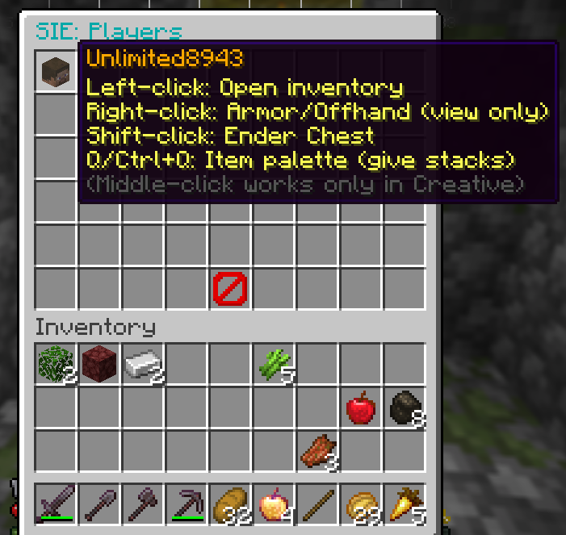
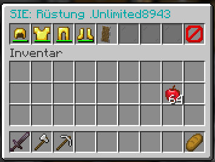
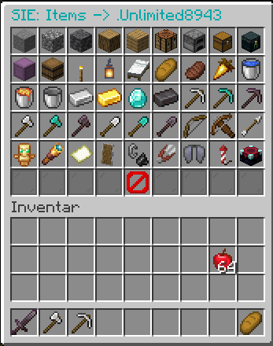

# SimpleInventarEdit

A **lightweight** Paper plugin that lets operators (or trusted moderators) browse and manage **player inventories directly in‑game** — no web UI, no external ports.

## ✨ Features

- **Player List GUI** (`/sie`)
  - **Left‑click** a player: open their **inventory** (vanilla container view; your own inventory shows at the bottom as usual)
  - **Right‑click** a player: open **Armor/Offhand** (read‑only) with a **Back** button
  - **Shift‑click** a player: open their **Ender Chest**
  - **Q / Ctrl+Q / Middle‑click** on a player: open a configurable **Item Palette** to quickly give items
    - Left‑click in palette = full stack
    - Right‑click in palette = 1 item
- **Clean navigation**
  - **Back** button inside Armor & Palette returns to the Player List
  - Optional: after closing target **Inventory/Ender Chest**, automatically return to the Player List
- **Configurable “Quick‑Give” Palette**
  - Define the palette in `config.yml` (`palette.items`) using valid Spigot/Paper material names
- **Secure & simple**
  - No web server, no extra ports
  - Access is controlled by a single permission

## ✅ Compatibility

- **Server:** Paper 1.21.x (tested on 1.21.4)
- **Java:** 17+
- Should also work on Spigot, but **Paper is recommended**.

## 📦 Installation

1. Place `SimpleInventarEdit-<version>.jar` into `plugins/`.
2. Start the server (this generates `plugins/SimpleInventarEdit/config.yml`).
3. Adjust `config.yml` to your needs.
4. Grant permission (example with LuckPerms):
   ```
   lp user <YourName> permission set sie.use true
   ```
5. Use `/sie` in game.

## 🔐 Permissions

| Permission | Description                        | Default |
|-----------|------------------------------------|---------|
| `sie.use` | Open the player list & all GUIs    | OP      |

## ⌨️ Command

```
/sie
```

Opens the Player List GUI.

## 🕹️ How to use (in‑game)

**Player List**
- **Left‑click** → target **Inventory**
- **Right‑click** → **Armor/Offhand** (read‑only, has a Back button)
- **Shift‑click** → **Ender Chest**
- **Q / Ctrl+Q / Middle‑click** → **Item Palette** (full stack or 1 item)

**Navigation**
- **Back** button in **Armor** & **Palette** returns to the Player List
- When closing the target **Inventory/Ender Chest** (ESC/E), it can optionally go back to the Player List (see `navigation.backOnClose`)

## ⚙️ Configuration (`config.yml`)

```yaml
# If true, closing the target inventory/ender chest (ESC/E) goes back to the player list
navigation:
  backOnClose: true

# Quick-give palette (Q/Ctrl+Q/Middle-click in the player list)
palette:
  enabled: true
  items:
    - STONE
    - COBBLESTONE
    - DEEPSLATE
    - OAK_LOG
    - OAK_PLANKS
    - CRAFTING_TABLE
    - FURNACE
    - CHEST
    - ENDER_CHEST
    - SHULKER_BOX
    - BARREL
    - TORCH
    - LANTERN
    - WHITE_BED
    - BREAD
    - COOKED_BEEF
    - GOLDEN_CARROT
    - WATER_BUCKET
    - LAVA_BUCKET
    - BUCKET
    - IRON_INGOT
    - GOLD_INGOT
    - DIAMOND
    - NETHERITE_INGOT
    - IRON_PICKAXE
    - DIAMOND_PICKAXE
    - NETHERITE_PICKAXE
    - IRON_AXE
    - DIAMOND_AXE
    - NETHERITE_AXE
    - IRON_SHOVEL
    - DIAMOND_SHOVEL
    - NETHERITE_SHOVEL
    - BOW
    - CROSSBOW
    - ARROW
    - TOTEM_OF_UNDYING
    - SPYGLASS
    - MAP
    - SHIELD
    - FLINT_AND_STEEL
    - SHEARS
    - ELYTRA
    - FIREWORK_ROCKET
    - ENCHANTING_TABLE
    - ANVIL
    - GRINDSTONE
    - SMITHING_TABLE
```

> **Notes**
> - Material names must match Spigot/Paper enums (e.g., `DIAMOND_PICKAXE`).
> - Invalid names are logged as warnings and ignored.

## 🧱 Limitations / Notes

- **Armor GUI** is **read‑only** (by design, as requested).
- Inventory/Ender Chest are **vanilla views**; therefore there’s no custom Back button inside them — the return happens on **close** if enabled.

## 🖼️ Screenshots

Create a folder `docs/images/` in this repo and drop your screenshots there, then reference them like:

```md



```

You can use this section to explain what each screen does and any tips for moderators.

## 🛠 Build (Maven)

Make sure your `pom.xml` has Paper’s repository and dependency (example):

```xml
<repositories>
  <repository>
    <id>papermc-repo</id>
    <url>https://repo.papermc.io/repository/maven-public/</url>
  </repository>
</repositories>

<dependencies>
  <dependency>
    <groupId>io.papermc.paper</groupId>
    <artifactId>paper-api</artifactId>
    <version>1.21.4-R0.1-SNAPSHOT</version>
    <scope>provided</scope>
  </dependency>
</dependencies>
```

Build:

```bash
mvn -U -DskipTests clean package
```

## 📜 License

Released under the **MIT License** – see `LICENSE`.
